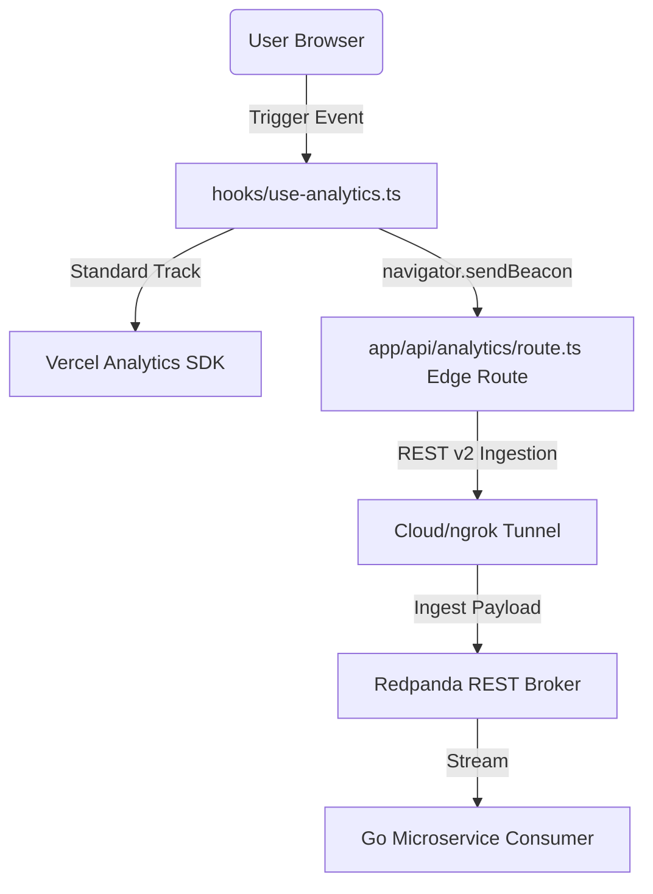

# Kafka Custom Analytics Pipeline Documentation

This document explains the architecture, design decisions, data routing strategy, and event list for the custom analytics tracking tunnel integrated within this Next.js 15+ App Router application.

## 1. System Architecture Overview

The telemetry pipeline runs **in parallel** with the existing Vercel Analytics. It is designed to act as a zero-latency, reliable event forwarding system that streams custom browser events to a Redpanda Kafka broker proxy.



---

## 2. The Current Approach

### Client-Side: `navigator.sendBeacon` with `fetch` Fallback

- **Problem**: Traditional `fetch()` or `Axios` HTTP POST requests can be abruptly aborted by the browser if a user clicks a link and navigates away from the page before the promise resolves. This leads to massive telemetry data loss (up to 30% of click events are routinely lost this way).
- **Solution**: We package the analytics payload inside a `Blob` and invoke `navigator.sendBeacon()`. The browser hands this request over to its network subsystem, which executes it asynchronously in the background. It is guaranteed to complete even if the user closes the tab or navigates away.
- **Resiliency**: If `sendBeacon` fails (due to queue saturation) or is not supported in a legacy user-agent, the hook automatically falls back to an async `fetch` utilizing the `keepalive: true` flag.

### Server-Side: Next.js Edge Runtime Route Handler

- **Problem**: Setting up a traditional server route incurs cold-start overhead and is slow to capture client geographical metadata.
- **Solution**: The proxy route handler `/api/analytics` is configured with `export const runtime = "edge"`. This runs on Vercel's Edge nodes (closer to the user), minimizing response latency to single-digit milliseconds.
- **Auto-Geolocation Enrichment**: The Edge environment extracts proprietary Vercel headers (`x-vercel-ip-city`, `x-vercel-ip-country`, `x-vercel-ip-country-region`, `x-forwarded-for`) and attaches them to the payload.
- **Local Development Mocking**: To prevent developer friction and make testing seamless locally (where these headers are absent), the Edge route mocks these headers under `process.env.NODE_ENV === "development"`.

---

## 3. Partition Key Routing Strategy

To guarantee high scalability and load balancing in our Kafka cluster, we chose **Ephemeral Client-Side Session IDs**.

### The Problem of "anonymous" Keys

If anonymous traffic has no key, or a static key like `"anonymous"`, Kafka's default partitioning hash:
$$\text{Partition} = \text{Hash}(\text{key}) \pmod{\text{Total Partitions}}$$
would direct 100% of anonymous traffic to the **same hot partition**. This breaks cluster scalability.

### Our Solution

1. **Generation**: When the browser loads the hook, it generates or retrieves an ephemeral UUID stored inside the browser's `sessionStorage`:
   - It persists for the duration of the browser tab/session.
   - It uses `crypto.randomUUID()` where available, with a fast pseudorandom fallback if blocked.
2. **Key Resolution**: Inside `/api/analytics/route.ts`, the edge route computes the Kafka message key:
   - **`userId` (Primary)**: If the user is authenticated, it uses their database user ID. This guarantees all events for a specific user across different devices and sessions land on the same partition in exact chronological order.
   - **`sessionId` (Secondary)**: If anonymous, it uses the browser's temporary session ID. This ensures User A's session goes to Partition 1, and User B's session goes to Partition 2, **balancing the load evenly across all partitions** while preserving chronological ordering within that specific anonymous session.
   - **`"anonymous"` (Fallback)**: Used only if both of the above fail.

---

## 4. Tracked Events & Payload Schema

### Strict Ingestion Schema

All payloads forwarded to the broker at `process.env.ANALYTICS_BROKER_URL` use the `Content-Type: application/vnd.kafka.json.v2+json` header and follow this exact template:

```json
{
  "records": [
    {
      "key": "user_id_or_session_uuid",
      "value": {
        "event": "YOUR_EVENT_NAME",
        "timestamp": "ISO_8601_STRING",
        "location": {
          "city": "Chicago",
          "country": "US",
          "region": "IL"
        },
        "properties": {
          "ip": "12.34.56.78",
          "...customEventProperties"
        }
      }
    }
  ]
}
```

### Tracked Events List

| Event Name       | Trigger Context                                                    | Custom Properties                                                        |
| ---------------- | ------------------------------------------------------------------ | ------------------------------------------------------------------------ |
| `Link Click`     | User clicks an internal/external link wrapped in `TrackedLink`     | `url`, `text` (truncated), `location` (where on the page it was clicked) |
| `Page View`      | Triggered automatically on route transitions via `PageViewTracker` | `page` (pathname), `category`                                            |
| `Blog Post View` | Triggered when a blog article is loaded                            | `title`, `category`, `readTime`                                          |
| `Search`         | Triggered when a search query is submitted                         | `query` (truncated), `resultsCount`                                      |
| `Subscription`   | Triggered when subscribing to channels                             | `type` (`"newsletter"` or `"rss"`)                                       |
| `Social Share`   | Triggered when sharing a blog post                                 | `platform`, `url`                                                        |

---

## 5. Directory & Code Map

Here are the locations of the core files powering this pipeline:

- **Client Analytics Hook**: [hooks/use-analytics.ts]
  - Handles the `sessionStorage` session UUID generation.
  - Implements the dual-tracking execution flow (`track()` + `sendCustomEvent()`).
  - Implements the `sendBeacon` payload transmission.
- **Non-Link Click Tracking Hook**: [hooks/use-click-tracking.ts]
  - Extends click tracking to non-anchor UI elements (buttons, modals, tabs).
- **Server-Side Edge Proxy**: [app/api/analytics/route.ts]
  - Edge Route Handler (`runtime = "edge"`).
  - Handles geolocation header extraction & local development mocking.
  - Encapsulates payload in the strict Redpanda Confluent REST JSON format.
- **Auto-Tracking Components**:
  - [PageViewTracker](/features/analytics/components/page-view-tracker.tsx): Implicitly fires page views on Next.js App Router navigation hooks.
  - [TrackedLink](/features/analytics/components/tracked-link.tsx): Reusable element that intercepts anchor tag clicks to log link analytics.
- **Unit Testing Suite**: [hooks/**tests**/use-analytics.test.ts]
  - Unit tests to verify standard tracking, `sendBeacon` triggers, and async `fetch` fallbacks.
